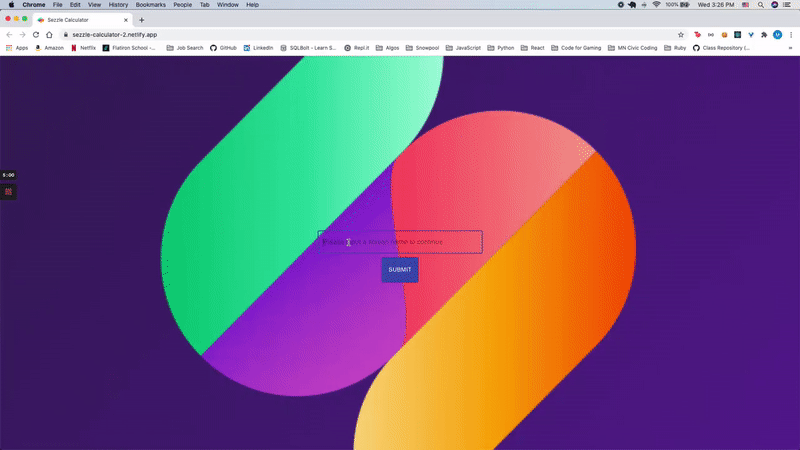
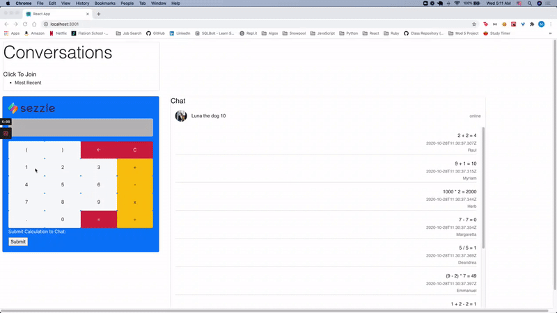
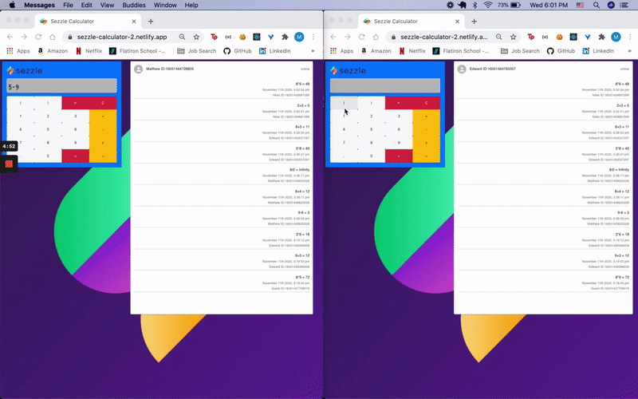

# Sezzle Calculator - Frontend

An application that provides multi-user chat with calculator functions in real-time. This [link](https://github.com/matthewsedlacek/sezzle-node-express-api) will direct you to the backend repository.

## Prompt

- Create a web app using any language which logs calculations as they happen and shares those calculations with everyone connected to the app.

- For example, user A and user B go to your app at the same time. User A calculates “5 + 5”, which equals “10". This is logged below the calculator as “5 + 5 = 10”. User B is updated about this calculation right after user A posts it. Now, user B calculates “3 x 4".This calculates to “12” and displays “3 x 4=12" right below the prior calculation. User A sees this update immediately after user B posts it.

- Results should remain between sessions. Only show the last 10 calculations descending from most recent to oldest. The calculator only needs to implement basic arithmetic operations, although you can add other math functions if you would like to impress. But don't forget to meet the basic requirements of the exercise first!

## Live Demo

Visit https://sezzle-calculator-chat.netlify.app/

## Local Installation

1. Fork this repository
2. Clone down the local branch into folder of your choice
3. `cd sezzle-frontend`
4. Run `npm install` in terminal
5. Run the backend server - refer to [backend](https://github.com/matthewsedlacek/sezzle-node-express-api/tree/local) repository and use the local branch
6. Run `npm start` in your terminal
7. Enjoy Sezzle Calculator

## Testing

To quickly test the application, open the live demo and input the below function into the console to submit 10 messages.

```javascript
const mult = document.querySelector("button[name='*']");
const equals = document.querySelector("button[name='=']");
for (let i = 0; i < 10; ++i) {
  document.querySelector(`button[name="${i}"]`).click();
  mult.click();
  document.querySelector(`button[name="${i}"]`).click();
  equals.click();
}
```

## Features

Users can:

**Login**

- Users can create a screen name or will be automatically labeled as Guest



**Calculator**

- Compute equations
- Clear the display
- Backspace miskeyed information
- Visit Sezzle's company page
- Submit equations to the chat



**Chat**

- Screen name is assigned by user or Guest by default
- ID is randomly assigned
- Text orientation shown based on if the message is associated with the username in the session
- Scroll to see what other users have posted and when (limited to 10 most recent)



## Technology Used

- React
- Node.js/Express.js as API
- Socket.io
- Boostrap
- Material UI

## Author

- Matthew Sedlacek - [Github](https://github.com/matthewsedlacek) [LinkedIn](https://www.linkedin.com/in/matthew-sedlacek/)

## Licensing

This program is free software; you can redistribute it and/or modify it under the terms of the GNU General Public License as published by the Free Software Foundation; either version 2 of the License, or (at your option) any later version.
This program is distributed in the hope that it will be useful, but WITHOUT ANY WARRANTY; without even the implied warranty of MERCHANTABILITY or FITNESS FOR A PARTICULAR PURPOSE. See the GNU General Public License for more details.
For a copy of the GNU General Public License along write to the Free Software Foundation, Inc., 51 Franklin Street, Fifth Floor, Boston, MA 02110-1301 USA.
